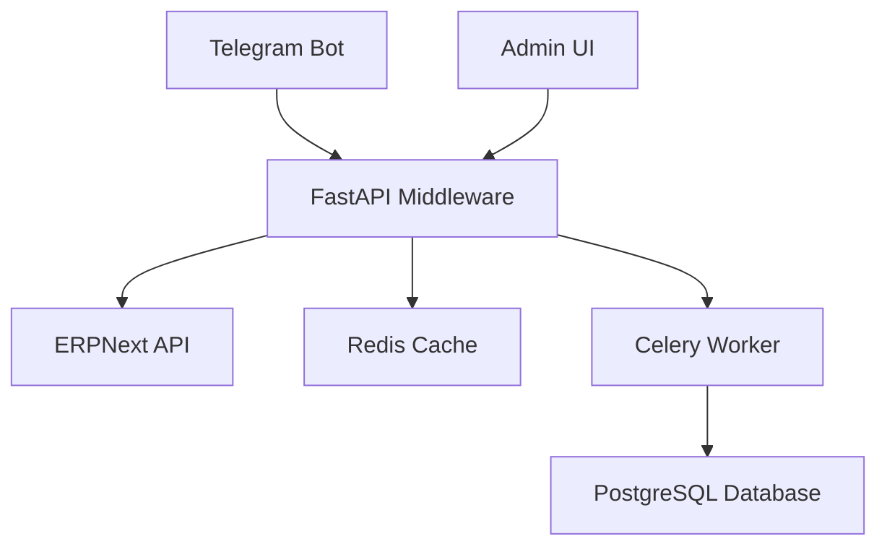

# ARCHITECTURE.md

## System Architecture Overview

Telegram CRM MVP is a modern customer relationship management system that integrates Telegram messaging with ERPNext through a comprehensive loyalty program. The system follows a modular architecture with clear separation between frontend, backend, and external integrations.

## High-Level Architecture



## Frontend Architecture (admin-ui)

### Technology Stack
- **Framework**: React 18 + TypeScript
- **Build Tool**: Vite
- **State Management**: MobX (implied by stores/auth.tsx)
- **HTTP Client**: Custom API layer (api.ts)
- **Styling**: CSS Modules/Global Styles

### Key Components
1. **App.tsx** - Main application component with routing and layout
2. **AuthWorker.ts** - Authentication token management
3. **Stores/auth.tsx** - Auth state management
4. **API Layer** - api.ts for backend communication
5. **Views**:
   - LoyaltyTmaView.tsx - Loyalty program management
   - MarketingView.tsx - Marketing campaigns
6. **Components**:
   - AnalyticsCharts.tsx - Data visualization
   - IntegrationSettings.tsx - ERP integration configuration
   - ProductImport.tsx - Product management
   - LanguageSwitcher.tsx - i18n support

### Authentication Flow
- JWT token-based authentication
- Access token (30min expiry) + Refresh token (30 days expiry)
- HTTP-only cookies for secure token storage
- Automatic token refresh on expiry

## Backend Architecture (middleware)

### Technology Stack
- **Framework**: FastAPI (Python 3.14)
- **Telegram Bot**: aiogram 3.25+
- **Async Workers**: Celery + Redis
- **Database**: SQLite (dev), PostgreSQL (prod)
- **Cache**: Redis 7
- **Integration**: ERPNext API (with mock mode)

### Architecture Layers

#### 1. API Layer (Endpoints)
```
admin_api.py - Admin operations
admin_auth_api.py - Auth endpoints (login, refresh, logout)
integrations_api.py - Integration configuration
marketing_api.py - Marketing operations
products_api.py - Product management
tma_api.py - Telegram Mini App endpoints
test_api.py - Test endpoints
```

#### 2. Business Logic Layer
```
auth.py - JWT token generation/validation, authentication
handlers.py - Telegram bot message handlers
loyalty.py - Loyalty program logic (points accrual/redemption)
worker.py - Celery task worker
config.py - Configuration management
db.py - Database session management
```

#### 3. Data Access Layer
- **Database Models**: Implicit via SQLAlchemy/SQLite
- **Session Management**: db.py handles async connections
- **Integrations**: integrations/ directory (ERPNext API client)

#### 4. Middleware Layer
```
middlewares.py - FastAPI middleware (auth, CORS, rate limiting)
request_context.py - Request context management
security.py - Security utilities
```

### Authentication & Authorization
- JWT token validation middleware
- Admin user authentication (login/password, secret key)
- API key validation
- Rate limiting (60 requests/minute per user)

### External Integrations

#### ERPNext Integration
- REST API client with mock mode for development
- Synchronization of customers, orders, loyalty points
- Configurable via environment variables

#### Telegram Bot Integration
- aiogram-based bot with command handlers
- Webhook for real-time updates
- Message processing pipeline

### Background Processing
- Celery workers for async tasks
- Redis as message broker
- Task queue for ERP synchronization, notifications

## Database Architecture

### Development (SQLite)
- Single file database (crm.db)
- Auto-generated schema on startup

### Production (PostgreSQL 15)
- Relational database with proper indexing
- Connection pooling
- Migration management

### Key Entities
- Users (admin users)
- Customers (Telegram users)
- Products
- Orders
- Loyalty points
- Integration settings

## Deployment Architecture

### Development
- Local backend (uvicorn) on port 8000
- Local frontend (Vite dev server) on port 5173
- SQLite database
- Redis for caching/background tasks

### Production (Docker)
```
┌─────────────────────────────────────────────────────┐
│               Docker Compose Stack                  │
├─────────────────────────┬───────────────────────────┤
│  ┌───────────────────┐  │  ┌───────────────────┐  │
│  │  Middleware (app) │  │  │  Admin UI (dist)  │  │
│  └──────────┬────────┘  │  └──────────┬────────┘  │
│             │           │             │           │
│  ┌──────────▼────────┐  │  ┌──────────▼────────┐  │
│  │   PostgreSQL 15   │  │  │    Nginx Proxy   │  │
│  └──────────┬────────┘  │  └──────────┬────────┘  │
│             │           │             │           │
│  ┌──────────▼────────┐  │             │           │
│  │    Redis 7        │  │             │           │
│  └──────────┬────────┘  │             │           │
│             │           │             │           │
│  ┌──────────▼────────┐  │             │           │
│  │  Celery Workers   │  │             │           │
│  └───────────────────┘  │             │           │
│                         │             │           │
│                         │             │           │
│                         │  ┌──────────▼────────┐  │
│                         │  │  SSL Certificate  │  │
│                         │  └───────────────────┘  │
│                         │                         │
└─────────────────────────┴───────────────────────────┘
```

## Security Architecture

### Key Features
- **JWT Authentication**: Token-based API access
- **Rate Limiting**: 60 requests/minute per IP
- **Input Validation**: Pydantic schemas
- **CORS Configuration**: Restrictive in production
- **Webhook Verification**: Telegram secret validation
- **Mock Mode**: Safe development without real ERP access

### Compliance
- GDPR and 152-FZ (Russian data protection law) compliant
- Consent management for customer data

## Testing Architecture

### Test Types
1. **Unit Tests**: Core business logic
2. **Integration Tests**: API endpoints
3. **E2E Tests**: Critical user journeys (Playwright)
4. **Load Tests**: Concurrent users support

### Test Infrastructure
- pytest for Python tests
- Playwright for E2E tests
- Coverage tracking
- Cross-platform test scripts (Windows/Linux)