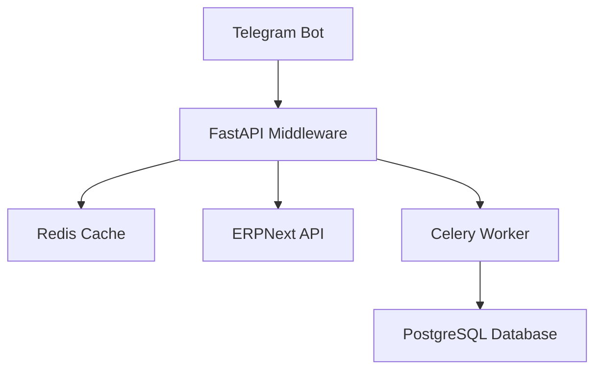

# ARCHITECTURE.md - System Architecture

## Overview

ErpGreeHouse is a modern Customer Relationship Management (CRM) system with Telegram integration and ERPNext loyalty program support. The architecture follows a microservices approach with async Python backend, React frontend, and Docker containerization for production deployment.

## System Architecture



## Core Components

### 1. Telegram Bot (aiogram)

**Purpose**: User interaction interface through Telegram messaging.

**Key Features**:
- Command handling (start, help, order, balance)
- User registration and authentication
- Order processing and status updates
- Loyalty points management
- Webhook integration for real-time updates

**Integration Points**:
- `/webhook` - Telegram webhook endpoint
- `middleware/app/handlers.py` - Command and callback handlers

### 2. FastAPI Middleware

**Purpose**: API gateway and business logic layer.

**Key Features**:
- RESTful API endpoints
- Request validation and authentication
- Rate limiting and circuit breaking
- CORS support
- Health checks

**API Categories**:
- `admin_api.py` - Admin UI endpoints
- `admin_auth_api.py` - Authentication and authorization
- `analytics_api.py` - Analytics and reporting
- `auth.py` - JWT token management
- `dashboard_api.py` - Dashboard and metrics
- `integrations_api.py` - ERP integration settings
- `marketing_api.py` - Marketing and campaigns
- `products_api.py` - Product catalog management
- `test_api.py` - Testing endpoints
- `tma_api.py` - Telegram Mini App endpoints

### 3. Database Layer

**Purpose**: Data persistence and retrieval.

**Development (SQLite)**:
- Single file database
- No setup required
- Stored in `crm.db`

**Production (PostgreSQL)**:
- Relational database
- Supports multiple connections
- Stored in PostgreSQL 15 database

**Key Tables**:
- `customers` - Customer profiles
- `orders` - Order history
- `transactions` - Financial transactions
- `loyalty_points` - Loyalty points balance
- `roles` - User roles
- `role_permissions` - Role-based permissions
- `products` - Product catalog
- `campaigns` - Marketing campaigns

### 4. Redis Cache

**Purpose**: Session management, caching, and task queue.

**Key Uses**:
- Session management (JWT token storage)
- Cache for frequently accessed data
- Celery task queue
- Rate limiting

**Configuration**:
```bash
REDIS_URL=redis://localhost:6379/0
```

### 5. Celery Workers

**Purpose**: Background task processing.

**Key Features**:
- Asynchronous task execution
- Periodic tasks via Celery Beat
- Task retry and error handling
- Integration with ERPNext

**Task Types**:
- Order synchronization with ERPNext
- Loyalty points calculation
- Marketing campaign scheduling
- Data export

### 6. ERPNext Integration

**Purpose**: Enterprise Resource Planning integration.

**Key Features**:
- Customer synchronization
- Order management
- Loyalty points integration
- Product catalog synchronization
- Mock mode for development

**API Endpoints**:
- `/api/method/frappe.client.get_list` - Get documents list
- `/api/method/frappe.client.get` - Get single document
- `/api/method/frappe.client.insert` - Create document
- `/api/method/frappe.client.update` - Update document

### 7. Admin UI (React)

**Purpose**: Web interface for administrators.

**Key Features**:
- Dashboard with metrics and charts
- Customer management
- Order processing
- Product catalog management
- Marketing campaign management
- Integration settings
- User and role management

**Technology**:
- React 19 with TypeScript
- Vite build tool
- ECharts for data visualization
- i18next for localization

## Authentication and Authorization

### JWT Authentication

**Token Flow**:
```
┌─────────┐    ┌──────────────┐    ┌─────────────────┐
│  Login  │───▶│ Generate     │───▶│ Set cookies:    │
│ /login  │    │ Tokens       │    │ - access_token  │
└─────────┘    └──────────────┘    │ - refresh_token │
                                    └─────────────────┘
                                          │
                                          ▼
┌─────────┐    ┌──────────────┐    ┌─────────────────┐
│  API    │◀───│ Validate     │◀───│ Include token   │
│ Request │    │ JWT          │    │ in Authorization│
└─────────┘    └──────────────┘    └─────────────────┘
       │
       │ (if expired)
       ▼
┌─────────┐    ┌──────────────┐    ┌─────────────────┐
│ Refresh │───▶│ Validate     │───▶│ Generate new    │
│ /refresh│    │ Refresh      │    │ Access token    │
└─────────┘    └──────────────┘    └─────────────────┘
       │
       │ (on logout or invalid)
       ▼
┌─────────┐    ┌──────────────┐    ┌─────────────────┐
│ Logout  │───▶│ Blacklist    │───▶│ Clear cookies   │
│ /logout │    │ Tokens       │    │ (access/refresh)│
└─────────┘    └──────────────┘    └─────────────────┘
```

**Token Types**:
- **Access Token**: Short-lived (15-30 minutes), used for API access
- **Refresh Token**: Long-lived (7 days), used to obtain new access tokens

**Configuration**:
```bash
JWT_SECRET_KEY=your-secret-key
JWT_ALGORITHM=HS256
JWT_ACCESS_TOKEN_EXPIRE_MINUTES=30
JWT_REFRESH_TOKEN_EXPIRE_DAYS=7
```

### Role-Based Access Control (RBAC)

**Roles**:
- **Owner**: Full system access
- **Manager**: Access to most features, excluding sensitive settings
- **Operator**: Limited access to customer and order management
- **Marketer**: Access to marketing and campaigns

**Permissions**:
```python
ALL_PERMISSIONS = [
    "dashboard.read",
    "customer.read",
    "customer.create",
    "customer.search",
    "customer.list",
    "pos.sale",
    "transaction.read",
    "product.read",
    "product.create",
    "product.update",
    "product.import",
    "integration.read",
    "integration.update",
    "settings.access",
    "marketing.campaigns",
    "marketing.users",
    "receipt.manual",
    "report.export",
    "analytics.read",
    "analytics.export",
]
```

## Data Flow

### Customer Registration

1. User sends `/start` command to Telegram bot
2. Bot sends registration form
3. User fills and submits form
4. Middleware validates and saves customer data
5. Customer is registered in both local database and ERPNext
6. Loyalty points account is created

### Order Processing

1. User places order via Telegram bot or Admin UI
2. Order is saved to local database
3. Order is synchronized with ERPNext
4. Customer receives order confirmation
5. Order status is updated in real-time
6. Loyalty points are awarded

### Loyalty Points Redemption

1. User requests to redeem points
2. System checks point balance
3. If sufficient, order total is discounted
4. Points are deducted from user's balance
5. Transaction is logged

## Performance Features

### Async Architecture

All API endpoints are async using Python's asyncio framework, allowing for high concurrency.

### Rate Limiting

```python
# Rate limiting configuration
MAX_CONCURRENT_REQUESTS = 100
RATE_LIMIT_PER_MINUTE = 60
```

### Circuit Breaker

```python
# Circuit breaker configuration
CIRCUIT_BREAKER_ENABLED = True
CIRCUIT_BREAKER_FAILURE_THRESHOLD = 5
CIRCUIT_BREAKER_RECOVERY_TIMEOUT = 300  # 5 minutes
```

### Caching

Frequently accessed data (products, customers) is cached in Redis with configurable TTL.

## Security Features

### Input Validation

All API endpoints validate inputs using Pydantic models.

### SQL Injection Prevention

All database queries use parameterized statements.

### XSS Protection

All user-generated content is properly escaped.

### CORS

```bash
CORS_ORIGINS=http://localhost:5173,https://your-domain.com
```

### 152-FZ Compliance

The system is compliant with Russian data protection law (152-FZ).

## Deployment Architecture

### Development Environment

```
┌─────────────────┐    ┌─────────────────┐    ┌─────────────────┐
│  Telegram Bot   │────│  FastAPI        │────│  SQLite         │
│  (aiogram)      │    │  (localhost:8000)│    │  (crm.db)       │
└─────────────────┘    └─────────────────┘    └─────────────────┘
                              │
                              │
                              ▼
                     ┌─────────────────┐
                     │  Redis          │
                     │  (localhost:6379)│
                     └─────────────────┘
                              │
                              │
                              ▼
                     ┌─────────────────┐
                     │  React Dev      │
                     │  (localhost:5173)│
                     └─────────────────┘
```

### Production Environment

```
┌─────────────────┐    ┌─────────────────┐    ┌─────────────────┐
│  Telegram Bot   │────│  Nginx          │────│  FastAPI        │
│  (api.telegram.org)│ │  (reverse proxy)│    │  (uWSGI)        │
└─────────────────┘    └─────────────────┘    └─────────────────┘
                                                  │
                                                  │
                    ┌─────────────────┐          │          ┌─────────────────┐
                    │  PostgreSQL     │──────────┼──────────│  Redis          │
                    │  (15-alpine)    │          │          │  (8.0-alpine)    │
                    └─────────────────┘          │          └─────────────────┘
                                                  │
                                                  ▼
                                       ┌─────────────────┐
                                       │  Celery Workers │
                                       │  (4 concurrency)│
                                       └─────────────────┘
                                                  │
                                                  │
                                                  ▼
                                       ┌─────────────────┐
                                       │  ERPNext        │
                                       │  (version-15)   │
                                       └─────────────────┘
```

## Monitoring and Logging

### Health Checks

- `/health` - Application health check
- `/health/db` - Database health check
- `/health/redis` - Redis health check
- `/health/erp` - ERPNext health check

### Metrics

Prometheus metrics are available at `/metrics`.

### Logging

- File logging with daily rotation
- Log levels: DEBUG, INFO, WARNING, ERROR, CRITICAL
- Log file: `backend.log`