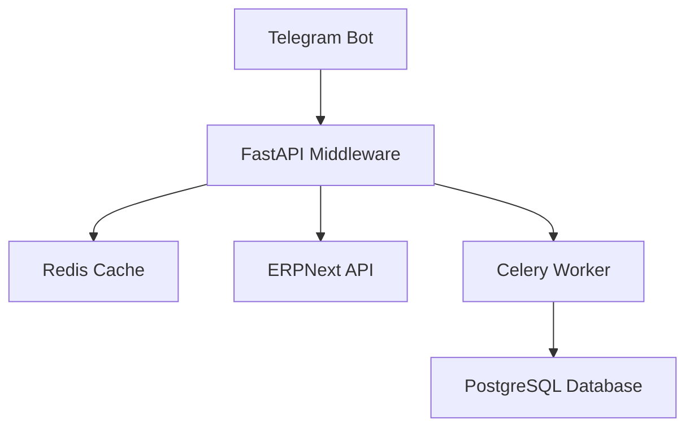

# STACK.md - Technology Stack

## Overview

ErpGreeHouse is a modern CRM system with Telegram integration and ERPNext loyalty program support. The architecture follows a microservices approach with a FastAPI backend, React frontend, and Docker containerization for production deployment.

## Technology Stack

### Backend (Middleware)
- **Language**: Python 3.14
- **Framework**: FastAPI 0.129.0
- **Async Framework**: asyncio
- **Telegram Bot**: aiogram 3.25.0
- **HTTP Client**: httpx 0.28.1
- **Task Queue**: Celery 5.6.2
- **Cache**: Redis ≥7.2.0
- **Database**: SQLite (development), PostgreSQL 15 (production)
- **Authentication**: PyJWT 2.8.0
- **ERP Integration**: frappe-client (ERPNext)
- **Rate Limiting**: Custom implementation with circuit breaker (circuitbreaker 2.1.3)
- **Scheduler**: APScheduler 3.10.4
- **Monitoring**: Prometheus client 0.20.0
- **Environment**: python-dotenv 1.2.1

### Frontend (Admin UI)
- **Language**: TypeScript 5.9.3
- **Framework**: React 19.2.4
- **Build Tool**: Vite 7.3.1
- **UI Components**: Custom React components with TypeScript
- **Charts**: ECharts 6.0.0 with echarts-for-react 3.0.6
- **Localization**: i18next 25.8.13 with i18next-browser-languagedetector 8.2.1
- **QR Codes**: react-qr-code 2.0.18
- **API Client**: node-fetch 3.3.2
- **Testing**:
  - Unit: Vitest 4.0.18
  - E2E: Playwright 1.58.2
  - Coverage: @vitest/coverage-v8 4.0.18
  - Accessibility: @axe-core/playwright 4.11.1
  - Reporting: allure-playwright 3.4.5

### Development & DevOps
- **Code Quality**:
  - Python: Black formatter, isort, mypy, bandit
  - TypeScript: Biome 2.4.4
- **Package Management**: npm 10.x, pip 23.x
- **Pre-commit Hooks**: pre-commit with multiple checks (Black, isort, mypy, etc.)
- **Testing**: pytest 7.x with pytest-asyncio, pytest-cov, pytest-html
- **CI/CD**: GitHub Actions
- **Docker**: Docker 20.10+, Docker Compose 2.0+

### Production Infrastructure
- **Web Server**: Nginx (alpine)
- **Application Server**: Uvicorn 0.41.0
- **Database**: PostgreSQL 15 (alpine)
- **Cache**: Redis 8.0 (alpine)
- **ERP System**: ERPNext version-15
- **Database for ERP**: MariaDB 10.6
- **Reverse Proxy**: Nginx with SSL termination

## Key Dependencies

### Backend Dependencies
```
fastapi==0.129.0
uvicorn[standard]==0.41.0
aiogram==3.25.0
aiohttp==3.13.3
celery==5.6.2
redis>=7.2.0
httpx==0.28.1
python-dotenv==1.2.1
openpyxl==3.1.5
python-multipart==0.0.22
lxml>=6.0.1
PyJWT==2.8.0
frappe-client==0.1.0.dev0
circuitbreaker==2.1.3
APScheduler==3.10.4
prometheus-client==0.20.0
```

### Frontend Dependencies
```json
{
  "dependencies": {
    "@twa-dev/sdk": "^8.0.2",
    "echarts": "^6.0.0",
    "echarts-for-react": "^3.0.6",
    "i18next": "^25.8.13",
    "i18next-browser-languagedetector": "^8.2.1",
    "node-fetch": "^3.3.2",
    "react": "^19.2.4",
    "react-dom": "^19.2.4",
    "react-i18next": "^16.5.4",
    "react-qr-code": "^2.0.18"
  },
  "devDependencies": {
    "@axe-core/playwright": "^4.11.1",
    "@biomejs/biome": "^2.4.4",
    "@playwright/test": "^1.58.2",
    "@testing-library/jest-dom": "^6.6.3",
    "@testing-library/react": "^16.2.0",
    "@types/node": "^25.3.0",
    "@types/react": "^19.2.14",
    "@types/react-dom": "^19.2.3",
    "@vitejs/plugin-react": "^5.1.4",
    "@vitest/coverage-v8": "^4.0.18",
    "@vitest/ui": "^4.0.18",
    "allure-commandline": "^2.36.0",
    "allure-playwright": "^3.4.5",
    "dotenv-cli": "^11.0.0",
    "jsdom": "^25.0.1",
    "playwright": "^1.58.2",
    "typescript": "^5.9.3",
    "vite": "^7.3.1",
    "vitest": "^4.0.18"
  }
}
```

## Architecture Diagram



## Performance Targets

- **Response Time**: <200ms
- **Concurrent Users**: 1000+
- **Error Rate**: <1%
- **Async Processing**: Non-blocking with Celery

## Security Features

- **152-FZ Compliance**: Russian data protection law compliance
- **Rate Limiting**: Protection against abuse
- **Input Validation**: SQL injection and XSS prevention
- **JWT Authentication**: Secure API access
- **Webhook Validation**: Telegram webhook verification
- **Mock Mode**: Safe development without real ERPNext