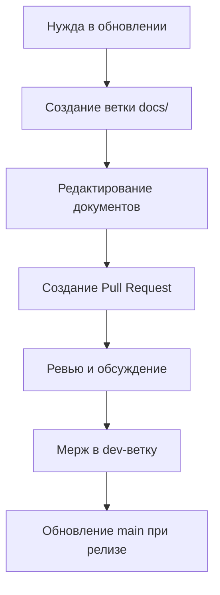

# 📚 Telegram CRM MVP - Documentation Hub

> **Правило: "Один источник истины"** - Любые изменения в документацию вносятся только через pull-request в dev-ветку с кратким описанием изменений.

## 📋 Документационная Структура

```
docs/
├── architecture/          # Архитектурные документы
├── plans/                # Планы разработки и управление
├── api/                   # API документация
├── testing/              # Тестирование и QA
├── deployment/           # Деплоймент и инфраструктура
└── guides/               # Руководства и инструкции
```

## 🎯 Критические Документы

### 📐 Архитектура
- **[System Architecture](architecture/system_architecture.md)** - Основная архитектура системы
- **[Technology Stack](architecture/technology_stack.md)** - Технологический стек и обоснование
- **[Security Guidelines](architecture/security_guidelines.md)** - Принципы безопасности

### 📊 Планы Разработки
- **[Development Plan](plans/development_plan.md)** - Комплексный план разработки
- **[MVP Scope](plans/mvp_scope.md)** - Определение MVP и критические функции
- **[Testing Strategy](plans/testing_strategy.md)** - Стратегия тестирования

### 🧪 Тестирование
- **[Test Report](testing/test_report.md)** - Результаты тестирования MVP
- **[Test Structure](testing/test_structure.md)** - Структура и организация тестов

### 🚀 Деплоймент
- **[Deployment Guide](deployment/deployment_guide.md)** - Руководство по деплойменту
- **[Infrastructure](deployment/infrastructure.md)** - Инфраструктурные требования

## 📝 Процесс Работы с Документацией

### 🔀 Работа через Pull Requests

1. **Создание изменений**:
   ```bash
   git checkout dev
   git pull origin dev
   git checkout -b docs/update-api-endpoints
   ```

2. **Внесение изменений**:
   - Редактируйте только соответствующие файлы в `/docs/`
   - Добавьте краткое описание изменений
   - Проверьте форматирование и орфографию

3. **Создание Pull Request**:
   - Название: `docs: краткое описание изменений`
   - Описание: Что изменено и зачем
   - Теги: `documentation`, `dev-branch`

### 🚫 Запрещено

- ❌ Прямые коммиты в main-ветку
- ❌ Редактирование без PR в dev-ветку
- ❌ Создание дубликатов документов
- ❌ Хранение локальных черновиков в репозитории

### ✅ Рекомендовано

- ✅ Использовать ветки `docs/` для документации
- ✅ Проверять орфографию перед коммитом
- ✅ Добавлять примеры кода и скриншоты
- ✅ Обновлять связанные документы

## 🔄 Жизненный Цикл Документации



## 📋 Чеклист для Pull Request с Документацией

- [ ] Изменения внесены только в `/docs/`
- [ ] Нет дубликатов файлов
- [ ] Проверена орфография
- [ ] Добавлены примеры при необходимости
- [ ] Обновлены связанные документы
- [ ] PR имеет краткое и понятное описание

## 🔍 Поиск и Навигация

Используйте `Ctrl+F` для поиска по документам. Основные разделы:

- **Архитектура**: Системная архитектура, технологии, безопасность
- **Планы**: Roadmap, MVP, стратегии разработки
- **API**: Эндпоинты, примеры, спецификации
- **Тестирование**: Результаты, стратегии, отчеты
- **Деплоймент**: Инструкции, инфраструктура, настройка
- **Руководства**: How-to, best practices, FAQ

## 📞 Контакты и Поддержка

Для вопросов по документации:
- Создайте issue с тегом `documentation`
- Используйте discussions для обсуждения структуры
- Обращайтесь к мейнтейнерам проекта

---

**Последнее обновление**: $(date +"%Y-%m-%d")  
**Версия**: 1.0.0  
**Статус**: Активно поддерживается