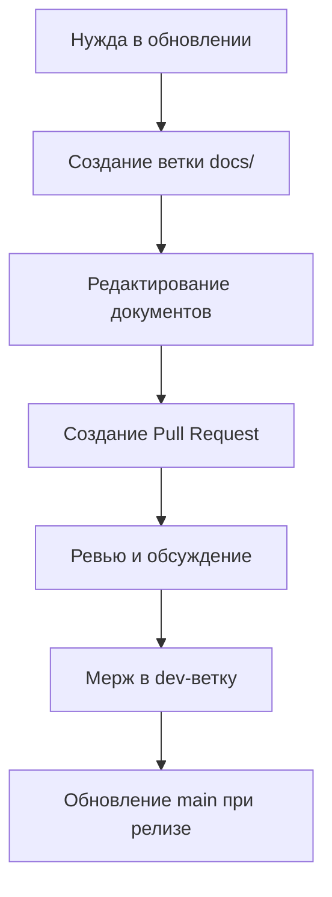

# 📚 Telegram CRM MVP - Documentation Hub

> **Правило: "Один источник истины"** - Любые изменения в документацию вносятся только через pull-request в dev-ветку с кратким описанием изменений.

## 🚀 Quick Start

### Prerequisites

- **Python 3.11+** - Install from [python.org](https://python.org) or Microsoft Store
  - ⚠️ **Windows**: Avoid the WindowsApps stub - install to `%LOCALAPPDATA%\Programs\Python\`
- **Node.js 18+** - Install from [nodejs.org](https://nodejs.org)
- **Redis** - Use Memurai (Windows) or Redis (Linux/Mac)

---

## 🔍 Полная проверка окружения и запуск

### Шаг 0: Проверка Redis

```bash
# Проверить, запущен ли Redis
redis-cli ping

# Ожидаемый ответ: PONG
```

**Если Redis не запущен:**

```bash
# Windows - запустить службу Redis
Start-Service Redis

# Или через services.msc
# 1. Win+R → services.msc
# 2. Найти "Redis" или "Memurai"
# 3. Правой кнопкой → Start
```

---

### Шаг 1: Проверка Python и venv

```bash
# Проверить версию Python
python --version
# Должно быть: Python 3.11.x или выше

# Пересоздать venv (если проблемы)
cd middleware
rmdir /s /q .venv          # Windows
python -m venv .venv

# Активировать venv
.\.venv\Scripts\Activate.ps1    # Windows PowerShell
```

---

### Шаг 2: Проверка .env файлов

```bash
# Backend (.env)
cd middleware
if not exist .env copy .env.example .env

# Test .env (для тестов)
if not exist .env.test copy .env.example .env.test
```

**Минимальный `.env` для разработки:**

```ini
TELEGRAM_BOT_TOKEN=test_token_123
REDIS_URL=redis://localhost:6379/0
ERP_MOCK_MODE=true
ADMIN_DEFAULT_USERNAME=admin
ADMIN_DEFAULT_PASSWORD=admin
DATABASE_URL=sqlite:///./local/crm.db
```

---

### Шаг 3: Установка зависимостей (Backend)

```bash
cd middleware
.\.venv\Scripts\Activate.ps1

# Обновить pip
python -m pip install --upgrade pip

# Установить все зависимости
pip install -r requirements.txt

# Установить тестовые зависимости
pip install pytest pytest-asyncio pytest-cov pytest-html pytest-mock fakeredis
```

---

### Шаг 4: Проверка базы данных

```bash
cd middleware
.\.venv\Scripts\Activate.ps1

# Инициализировать БД
python -c "from app.db import init_db; init_db()"

# Проверить, что файл БД создан
dir local\crm.db
```

---

### Шаг 5: Запуск Backend

```bash
cd middleware
.\.venv\Scripts\Activate.ps1

# Запустить сервер
python -m uvicorn app.main:app --reload --host 0.0.0.0 --port 8000

# Проверка: открыть в браузере
# http://localhost:8000/health
# http://localhost:8000/docs
```

---

### Шаг 6: Установка зависимостей (Frontend)

```bash
cd admin-ui

# Установить зависимости
npm install

# Проверить версию Node
node --version
# Должно быть: v18.x или выше
```

---

### Шаг 7: Запуск Frontend

```bash
cd admin-ui

# Запустить dev-сервер
npm run dev

# Проверка: открыть в браузере
# http://localhost:5173
```

---

### Шаг 8: Проверка работоспособности

| Компонент | URL | Ожидаемый результат |
|-----------|-----|---------------------|
| **Backend Health** | `GET http://localhost:8000/health` | `{"status": "ok"}` |
| **Backend DB** | `GET http://localhost:8000/health/db` | `{"status": "ok"}` |
| **Backend Redis** | `GET http://localhost:8000/health/redis` | `{"status": "ok"}` |
| **Backend ERP** | `GET http://localhost:8000/health/erp` | `{"status": "ok"}` |
| **Admin UI** | `http://localhost:5173` | Страница логина |
| **API Docs** | `http://localhost:8000/docs` | Swagger UI |

**Проверка через curl:**

```bash
curl http://localhost:8000/health
curl http://localhost:8000/health/db
curl http://localhost:8000/health/redis
```

---

### Шаг 9: Запуск тестов (Backend)

```bash
cd middleware
.\.venv\Scripts\Activate.ps1

# Unit тесты (быстро, ~5 сек)
pytest tests/unit/ -v

# Integration тесты (требуют Redis)
pytest tests/integration/ -v

# Все тесты
pytest tests/ -v

# С отчётом
pytest tests/ -v --html=reports/test_report.html --self-contained-html
```

---

### Шаг 10: Запуск тестов (Frontend E2E)

```bash
# Terminal 1 - запустить backend
cd ..\middleware
.\.venv\Scripts\Activate.ps1
python -m uvicorn app.main:app --reload

# Terminal 2 - запустить frontend
cd ..\admin-ui
npm run dev

# Terminal 3 - запустить E2E тесты
cd admin-ui
npx playwright test

# Или с UI
npx playwright test --ui

# С HTML отчётом
npx playwright test --reporter=html
npx playwright show-report
```

---

## 📋 Чек-лист полной проверки

### Перед запуском

- [ ] Redis запущен (`redis-cli ping` → `PONG`)
- [ ] Python 3.11+ установлен (`python --version`)
- [ ] Node.js 18+ установлен (`node --version`)
- [ ] venv создан и активирован
- [ ] `.env` создан и заполнен
- [ ] `.env.test` существует
- [ ] Зависимости установлены (`pip install -r requirements.txt`)
- [ ] БД инициализирована

### После запуска

- [ ] Backend отвечает на `/health`
- [ ] Backend отвечает на `/health/db`
- [ ] Backend отвечает на `/health/redis`
- [ ] Frontend открывается в браузере
- [ ] Логин работает (admin/admin)

### Тесты

- [ ] Unit тесты проходят (18/18)
- [ ] Integration тесты проходят (28/29)
- [ ] E2E тесты проходят

---

## 🚨 Troubleshooting

### Redis не подключается

```bash
# Проверить службу
Get-Service Redis

# Запустить
Start-Service Redis

# Проверить порт
netstat -an | findstr :6379
```

### Python не найден

```bash
# Проверить пути
where python

# Если показывает WindowsApps - переустановить Python
# Скачать с python.org, установить в %LOCALAPPDATA%\Programs\Python\
```

### Ошибка миграции БД

```bash
cd middleware
.\.venv\Scripts\Activate.ps1

# Удалить старую БД
del local\crm.db

# Инициализировать заново
python -c "from app.db import init_db; init_db()"
```

### Frontend не запускается

```bash
cd admin-ui

# Очистить кэш
rm -rf node_modules package-lock.json

# Переустановить
npm install

# Запустить
npm run dev
```

---

## 🔗 Быстрые команды

```bash
# Полный рестарт (Windows PowerShell)
cd c:\Users\vuser\repo\ErpGreeHouse

# 1. Redis
Start-Service Redis

# 2. Backend
cd middleware
.\.venv\Scripts\Activate.ps1
python -m uvicorn app.main:app --reload

# 3. Frontend (новый терминал)
cd admin-ui
npm run dev
```

---

## 📁 Структура проекта

```
ErpGreeHouse/
├── middleware/          # Backend (FastAPI + aiogram)
│   ├── .venv/          # Virtual environment
│   ├── .env            # Конфигурация
│   ├── .env.test       # Тестовая конфигурация
│   ├── app/            # Исходный код
│   ├── tests/          # Тесты
│   └── local/          # Локальные данные (БД)
│
├── admin-ui/           # Frontend (React + Vite)
│   ├── node_modules/
│   ├── src/
│   └── e2e/           # E2E тесты
│
└── docs/              # Документация
```

---

## 📋 Документационная Структура

```
docs/
├── architecture/          # Архитектурные документы
├── plans/                # Планы разработки и управление
├── api/                   # API документация
├── testing/              # Тестирование и QA
├── deployment/           # Деплоймент и инфраструктура
└── guides/               # Руководства и инструкции
```

## 🎯 Критические Документы

### 📐 Архитектура
- **[System Architecture](architecture/system_architecture.md)** - Основная архитектура системы
- **[Technology Stack](architecture/technology_stack.md)** - Технологический стек и обоснование
- **[Security Guidelines](architecture/security_guidelines.md)** - Принципы безопасности

### 📊 Планы Разработки
- **[Development Plan](plans/development_plan.md)** - Комплексный план разработки
- **[MVP Scope](plans/mvp_scope.md)** - Определение MVP и критические функции
- **[Testing Strategy](plans/testing_strategy.md)** - Стратегия тестирования

### 🧪 Тестирование
- **[Test Report](testing/test_report.md)** - Результаты тестирования MVP
- **[Test Structure](testing/test_structure.md)** - Структура и организация тестов

### 🚀 Деплоймент
- **[Deployment Guide](deployment/deployment_guide.md)** - Руководство по деплойменту
- **[Infrastructure](deployment/infrastructure.md)** - Инфраструктурные требования

## 📝 Процесс Работы с Документацией

### 🔀 Работа через Pull Requests

1. **Создание изменений**:
   ```bash
   git checkout dev
   git pull origin dev
   git checkout -b docs/update-api-endpoints
   ```

2. **Внесение изменений**:
   - Редактируйте только соответствующие файлы в `/docs/`
   - Добавьте краткое описание изменений
   - Проверьте форматирование и орфографию

3. **Создание Pull Request**:
   - Название: `docs: краткое описание изменений`
   - Описание: Что изменено и зачем
   - Теги: `documentation`, `dev-branch`

### 🚫 Запрещено

- ❌ Прямые коммиты в main-ветку
- ❌ Редактирование без PR в dev-ветку
- ❌ Создание дубликатов документов
- ❌ Хранение локальных черновиков в репозитории

### ✅ Рекомендовано

- ✅ Использовать ветки `docs/` для документации
- ✅ Проверять орфографию перед коммитом
- ✅ Добавлять примеры кода и скриншоты
- ✅ Обновлять связанные документы

## 🔄 Жизненный Цикл Документации



## 📋 Чеклист для Pull Request с Документацией

- [ ] Изменения внесены только в `/docs/`
- [ ] Нет дубликатов файлов
- [ ] Проверена орфография
- [ ] Добавлены примеры при необходимости
- [ ] Обновлены связанные документы
- [ ] PR имеет краткое и понятное описание

## 🔍 Поиск и Навигация

Используйте `Ctrl+F` для поиска по документам. Основные разделы:

- **Архитектура**: Системная архитектура, технологии, безопасность
- **Планы**: Roadmap, MVP, стратегии разработки
- **API**: Эндпоинты, примеры, спецификации
- **Тестирование**: Результаты, стратегии, отчеты
- **Деплоймент**: Инструкции, инфраструктура, настройка
- **Руководства**: How-to, best practices, FAQ

## 📞 Контакты и Поддержка

Для вопросов по документации:
- Создайте issue с тегом `documentation`
- Используйте discussions для обсуждения структуры
- Обращайтесь к мейнтейнерам проекта

---

**Последнее обновление**: $(date +"%Y-%m-%d")  
**Версия**: 1.0.0  
**Статус**: Активно поддерживается