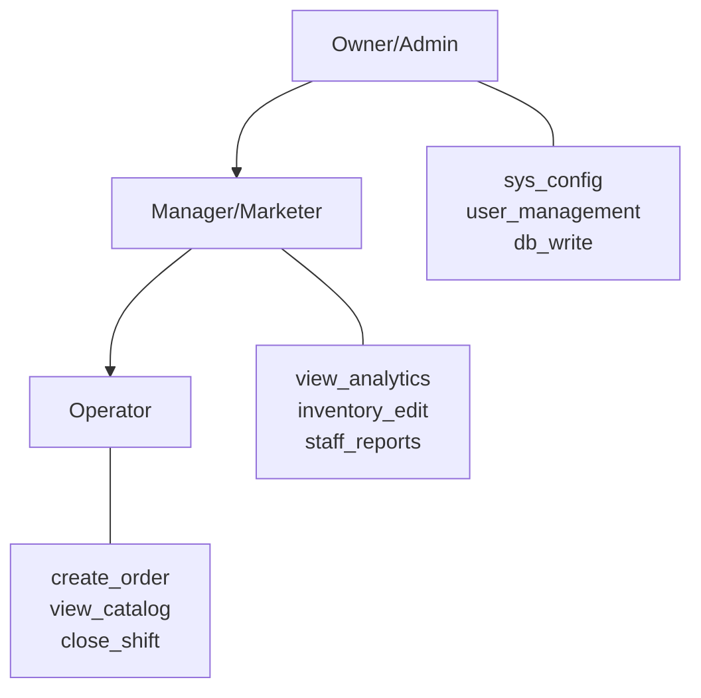
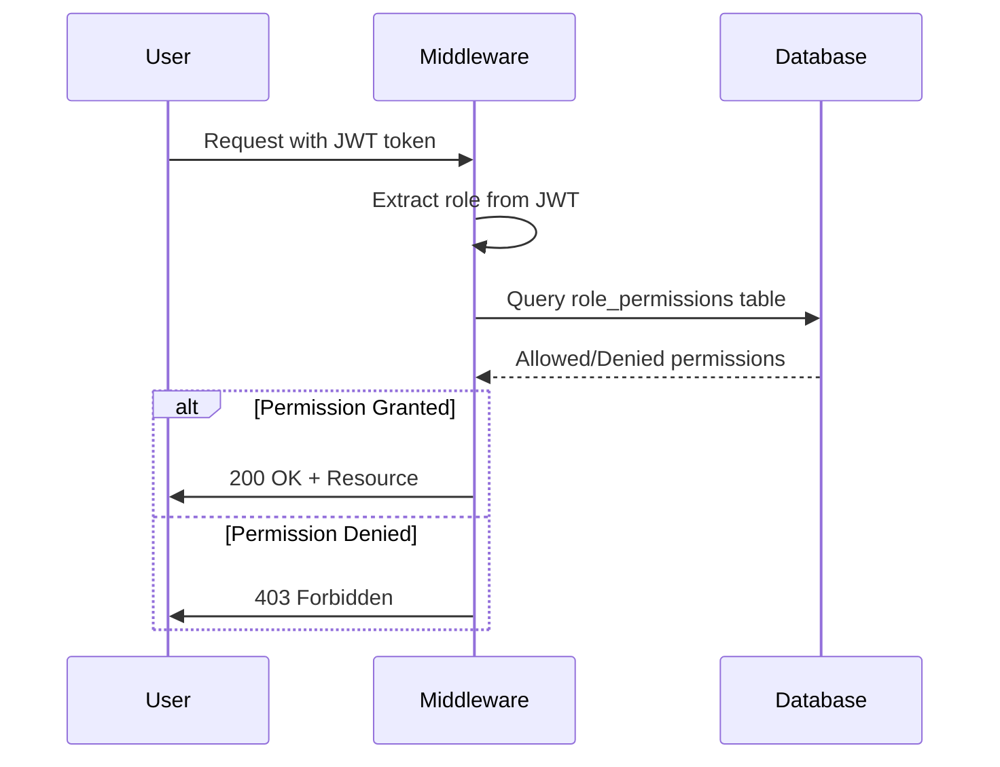

# Role-Based Access Control (RBAC) Matrix

This document defines the complete RBAC system for the ERP Greenhouse system, including immutable permissions that cannot be disabled and flexible permissions that can be configured per role.

---

## Overview

The RBAC system uses a two-layer approach:

1. **Immutable Layer**: Core permissions that are inherent to each role and cannot be removed
2. **Flexible Layer**: Optional permissions that can be enabled/disabled via the UI

---

## Role Hierarchy



---

## Immutable Permissions (Cannot Be Disabled)

These permissions are hardcoded in [`middleware/app/auth.py:get_default_permissions()`](middleware/app/auth.py:149) and are always granted to users with the corresponding role.

### Owner/Admin Role

| Permission | Code | Description |
|------------|------|-------------|
| System Configuration | `sys_config` | Access to system-wide settings |
| User Management | `user_management` | Create, edit, disable users |
| Database Write | `db_write` | Direct database write access |

### Manager/Marketer Role

| Permission | Code | Description |
|------------|------|-------------|
| View Analytics | `view_analytics` | Access to reports and analytics dashboards |
| Inventory Edit | `inventory_edit` | Modify product inventory and prices |
| Staff Reports | `staff_reports` | View staff performance reports |

### Operator Role

| Permission | Code | Description |
|------------|------|-------------|
| Create Order | `create_order` | Create new customer orders |
| View Catalog | `view_catalog` | Browse product catalog |
| Close Shift | `close_shift` | End shift and submit daily totals |

---

## Current Implementation Details

### Default Permission Sets

Located in [`middleware/app/auth.py:get_default_permissions()`](middleware/app/auth.py:149):

```python
def get_default_permissions(role: str) -> set[str]:
    if role == "operator":
        return {
            "dashboard.read",
            "customer.create",
            "customer.search",
            "customer.list",
            "customer.read",
            "pos.sale",
            "transaction.read",
            "product.read",
        }
    if role == "marketer" or role == "manager":
        return {
            "dashboard.read",
            "customer.read",
            "customer.list",
            "product.read",
            "product.create",
            "product.update",
            "product.import",
            "marketing.campaigns",
            "marketing.users",
            "integration.read",
            "integration.update",
            "report.export",
        }
    return set()
```

### Complete Permission List

All available permissions defined in [`middleware/app/auth.py:ALL_PERMISSIONS`](middleware/app/auth.py:201):

| Permission | Category | Default Role |
|------------|----------|--------------|
| `dashboard.read` | Dashboard | All roles |
| `customer.read` | Customers | All roles |
| `customer.create` | Customers | Operator+ |
| `customer.search` | Customers | Operator+ |
| `customer.list` | Customers | All roles |
| `pos.sale` | POS | Operator+ |
| `transaction.read` | Transactions | All roles |
| `product.read` | Products | All roles |
| `product.create` | Products | Manager+ |
| `product.update` | Products | Manager+ |
| `product.import` | Products | Manager+ |
| `integration.read` | Integrations | Manager+ |
| `integration.update` | Integrations | Manager+ |
| `settings.access` | Settings | Owner only |
| `marketing.campaigns` | Marketing | Manager+ |
| `marketing.users` | Marketing | Manager+ |
| `receipt.manual` | Receipts | Manager+ |
| `report.export` | Reports | Manager+ |

---

## Flexible Layer (Optional Permissions)

These permissions can be toggled on/off per role via the UI or database configuration.

### Definition

| Permission | Code | Description | Recommended Roles |
|------------|------|-------------|-------------------|
| Export CSV | `export_csv` | Export data to CSV format | Manager, Operator |
| Delete Logs | `delete_logs` | Delete system log entries | Owner |
| Bulk Import | `bulk_import` | Import multiple records at once | Manager |
| View Audit Trail | `view_audit` | Access audit log for all actions | Owner |
| Edit Roles | `edit_roles` | Modify role permissions | Owner |
| API Access | `api_access` | Access REST API endpoints | Manager, Operator |
| Webhook Management | `webhook_manage` | Configure outgoing webhooks | Manager |
| Price Override | `price_override` | Override product prices at POS | Manager |
| Refund Processing | `refund_process` | Process customer refunds | Manager |
| Loyalty Admin | `loyalty_admin` | Manage loyalty program | Manager |

### Database Schema

The flexible permissions are stored in the `role_permissions` table:

```sql
CREATE TABLE role_permissions (
    id INTEGER PRIMARY KEY AUTOINCREMENT,
    role TEXT NOT NULL,
    permission TEXT NOT NULL,
    is_allowed INTEGER NOT NULL DEFAULT 1,
    created_at TIMESTAMP DEFAULT CURRENT_TIMESTAMP,
    updated_at TIMESTAMP DEFAULT CURRENT_TIMESTAMP,
    UNIQUE(role, permission)
);
```

### Query Logic

Located in [`middleware/app/auth.py:get_role_permissions()`](middleware/app/auth.py:223):

```python
def get_role_permissions(role: str) -> list[str]:
    # Owner gets all permissions
    if role == "owner":
        return ["*"]
    
    # Get database permissions
    explicit_allowed = {r[0] for r in rows if r[1]}
    explicit_denied = {r[0] for r in rows if not r[1]}
    
    defaults = get_default_permissions(role)
    
    # Final = (Defaults - Denied) + Allowed
    final_perms = (defaults - explicit_denied) | explicit_allowed
    
    return list(final_perms)
```

---

## Permission Check Flow



---

## UI Configuration

### Admin Panel Features

1. **Role Management Screen**: `/admin/roles`
   - View all roles
   - View role permissions
   - Toggle flexible permissions

2. **Permission Matrix View**: `/admin/permissions`
   - Grid view of all permissions
   - Visual indicator for immutable vs flexible
   - Bulk toggle support

### Configuration API

Endpoints for managing role permissions:

| Method | Endpoint | Description |
|--------|----------|-------------|
| GET | `/api/v1/auth/roles` | List all roles |
| GET | `/api/v1/auth/roles/{role}/permissions` | Get role permissions |
| PUT | `/api/v1/auth/roles/{role}/permissions` | Update role permissions |

---

## Code Reference

| File | Description |
|------|-------------|
| [`middleware/app/auth.py`](middleware/app/auth.py) | Core RBAC logic |
| [`middleware/app/admin_api.py`](middleware/app/admin_api.py) | Admin role management endpoints |
| [`middleware/app/db.py`](middleware/app/db.py) | Database schema and queries |

---

## Security Rules

### Immutable Permission Enforcement

1. **Owner Role**: Cannot be demoted or have permissions removed by anyone
2. **Critical Permissions**: `sys_config`, `user_management`, `db_write` are always granted to owner
3. **Database Enforcement**: Attempting to delete immutable permissions should fail at application level

### Flexible Permission Rules

1. **Defaults**: Start with default permissions, add/remove as needed
2. **Explicit Denials**: Permissions explicitly denied override defaults
3. **Explicit Allows**: Permissions explicitly allowed are added to defaults
4. **Formula**: `Final = (Defaults - Denied) + Allowed`

---

## Migration Guide

### Adding New Flexible Permission

1. Add permission to [`ALL_PERMISSIONS`](middleware/app/auth.py:201) list
2. Create database migration to add to `role_permissions` table
3. Add to appropriate default role in [`get_default_permissions()`](middleware/app/auth.py:149) if needed
4. Update admin UI to show new permission
5. Document in this matrix

### Changing Immutable Permissions

**NOT RECOMMENDED**: Immutable permissions are designed to be permanent. If absolutely necessary:

1. Modify [`get_default_permissions()`](middleware/app/auth.py:149) in auth.py
2. This only affects NEW permissions granted - existing users keep current set
3. Document the change and reason
