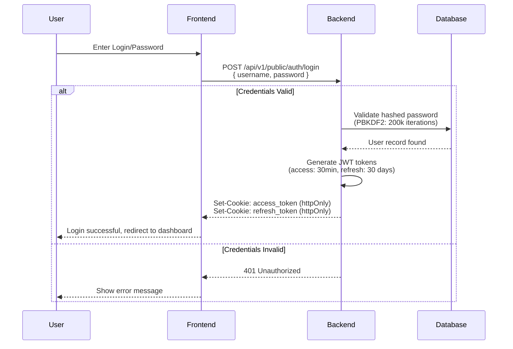
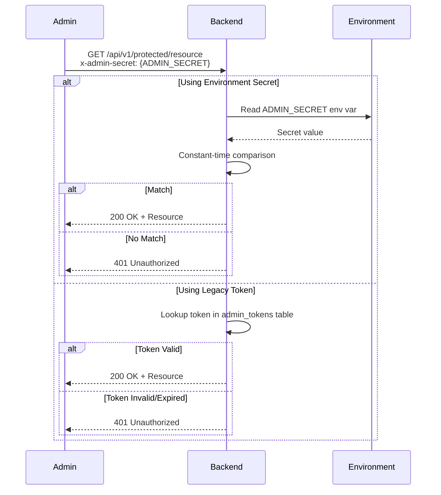
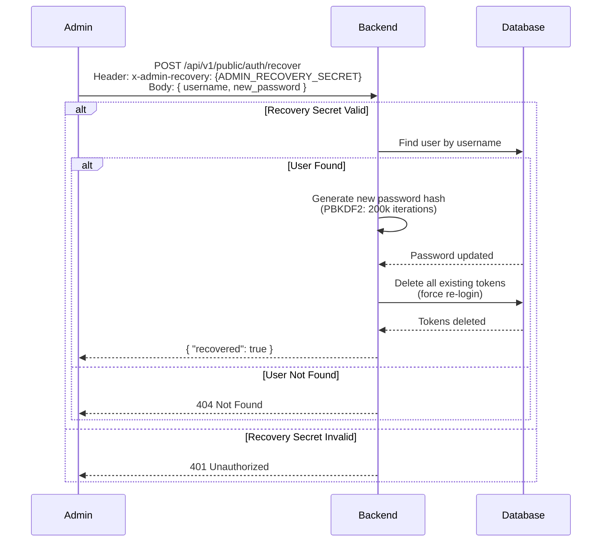

# User Journey Documentation

This document describes all authentication and authorization flows in the ERP Greenhouse system.

---

## A. Standard Entry Flow

The standard authentication flow uses JWT tokens delivered via HttpOnly cookies for maximum security.

### Flow Diagram



### Technical Details

| Aspect | Details |
|--------|---------|
| **Endpoint** | `POST /api/v1/public/auth/login` |
| **Request Body** | `{ "username": string, "password": string }` |
| **Response Headers** | `Set-Cookie` with httpOnly cookies |
| **Access Token** | 30-minute expiry (configurable via `JWT_ACCESS_TOKEN_EXPIRE_MINUTES`) |
| **Refresh Token** | 30-day expiry (configurable via `JWT_REFRESH_TOKEN_EXPIRE_DAYS`) |
| **Cookie Flags** | `httponly=true`, `samesite=lax`, `secure={ENV_BASED}` |

### Password Storage

- **Algorithm**: PBKDF2-HMAC-SHA256
- **Default Iterations**: 200,000 (configurable via `ADMIN_PBKDF2_ITER`)
- **Salt**: Random 32-byte salt per user, stored in `password_salt` column

### Code Reference

- **Login Endpoint**: [`middleware/app/admin_auth_api.py:login()`](middleware/app/admin_auth_api.py:100)
- **JWT Creation**: [`middleware/app/auth.py:create_access_token()`](middleware/app/auth.py:17)
- **Password Hashing**: [`middleware/app/security.py:hash_password()`](middleware/app/security.py)

---

## B. Admin Backdoor (CI/CD & Emergency Access)

The admin backdoor provides emergency access via a static secret header, bypassing database lookup for predefined root credentials.

### Flow Diagram



### Supported Endpoints

The backdoor works on all protected endpoints through the `require_jwt_auth` middleware:

1. **Authentication Layer**: [`middleware/app/admin_auth_api.py:require_jwt_auth()`](middleware/app/admin_auth_api.py:285)
2. **Legacy Validation**: [`middleware/app/admin_auth_api.py:require_admin_token_or_env()`](middleware/app/admin_auth_api.py:229)

### Header Specification

| Header | Value | Environment Variable |
|--------|-------|---------------------|
| `x-admin-secret` | Static secret string | `ADMIN_SECRET` |

### Security Rules

1. **Environment-Specific**:
   - **Production**: Should be DISABLED (JWT only)
   - **Development/Demo**: Allowed for testing

2. **Token Format Detection**:
   - JWT tokens (2 dots in format `xxx.yyy.zzz`) are validated as JWT
   - Non-JWT tokens are validated against `ADMIN_SECRET` or database tokens

3. **Critical Security Rule**: If a JWT is provided but fails validation, the system returns 401 immediately. It does NOT fall back to legacy authentication.

### Configuration

```bash
# Enable/disable backdoor (recommended: false in production)
ADMIN_SECRET=your-secure-secret-here

# Bootstrap default admin on startup
ADMIN_BOOTSTRAP_DEFAULT=true
ADMIN_DEFAULT_USERNAME=admin
ADMIN_DEFAULT_PASSWORD=secure-password
ADMIN_DEFAULT_ROLE=owner
```

### Code Reference

- **Token Validation**: [`middleware/app/admin_auth_api.py:require_admin_token_or_env()`](middleware/app/admin_auth_api.py:229)
- **JWT Detection**: [`middleware/app/admin_auth_api.py:_is_jwt_format()`](middleware/app/admin_auth_api.py:222)
- **Constant-time Comparison**: [`middleware/app/security.py:constant_time_equals()`](middleware/app/security.py)

---

## C. Password Recovery Flow

The password recovery flow allows administrators to reset user passwords via a secure recovery endpoint.

### Flow Diagram



### Technical Details

| Aspect | Details |
|--------|---------|
| **Endpoint** | `POST /api/v1/public/auth/recover` |
| **Required Header** | `x-admin-recovery: {ADMIN_RECOVERY_SECRET}` |
| **Request Body** | `{ "username": string, "new_password": string }` |
| **Password Requirements** | Minimum 8 characters, maximum 200 |
| **Token Invalidation** | All existing `admin_tokens` are deleted |

### Configuration

```bash
# Required for recovery to work
ADMIN_RECOVERY_SECRET=your-recovery-secret-here

# PBKDF2 iterations (optional, default: 200000)
ADMIN_PBKDF2_ITER=200000
```

### Current Implementation Status

**Location**: [`middleware/app/admin_auth_api.py:recover_password()`](middleware/app/admin_auth_api.py:636)

The implementation is functional but has the following characteristics:

1. **Single-Factor Recovery**: Only requires the recovery secret, no email verification
2. **No Audit Trail**: Does not log who performed the reset or when
3. **Immediate Effect**: All tokens are invalidated immediately
4. **No User Notification**: Does not send any notification to the user

### Security Considerations

1. **Secret Management**: The recovery secret must be:
   - Different from `ADMIN_SECRET`
   - Rotated periodically
   - Stored securely (not in version control)

2. **Access Control**: Limit access to the recovery endpoint:
   - Use network restrictions (IP allowlist)
   - Consider rate limiting
   - Log all recovery attempts

3. **Recommended Enhancements**:
   - Add email/SMS notification to user
   - Add audit log entry
   - Add rate limiting
   - Consider multi-factor recovery

### Code Reference

- **Recovery Endpoint**: [`middleware/app/admin_auth_api.py:recover_password()`](middleware/app/admin_auth_api.py:636)
- **Password Hashing**: [`middleware/app/security.py:hash_password()`](middleware/app/security.py)
- **Token Invalidation**: [`middleware/app/admin_auth_api.py:662`](middleware/app/admin_auth_api.py:662)

---

## Security Summary

| Flow | Security Level | Use Case |
|------|----------------|----------|
| Standard Login | **HIGH** | Production user authentication |
| Admin Backdoor | **MEDIUM** | CI/CD, emergency access, development |
| Password Recovery | **MEDIUM** | Admin password reset |

### Production Recommendations

1. **Disable backdoor in production**: Set `ADMIN_SECRET` to empty or remove it
2. **Use strong recovery secret**: Minimum 32 characters, randomly generated
3. **Enable secure cookies**: Set `ADMIN_COOKIE_SECURE=true`
4. **Monitor authentication logs**: Watch for brute force attempts
5. **Implement rate limiting**: Prevent login/recovery abuse
