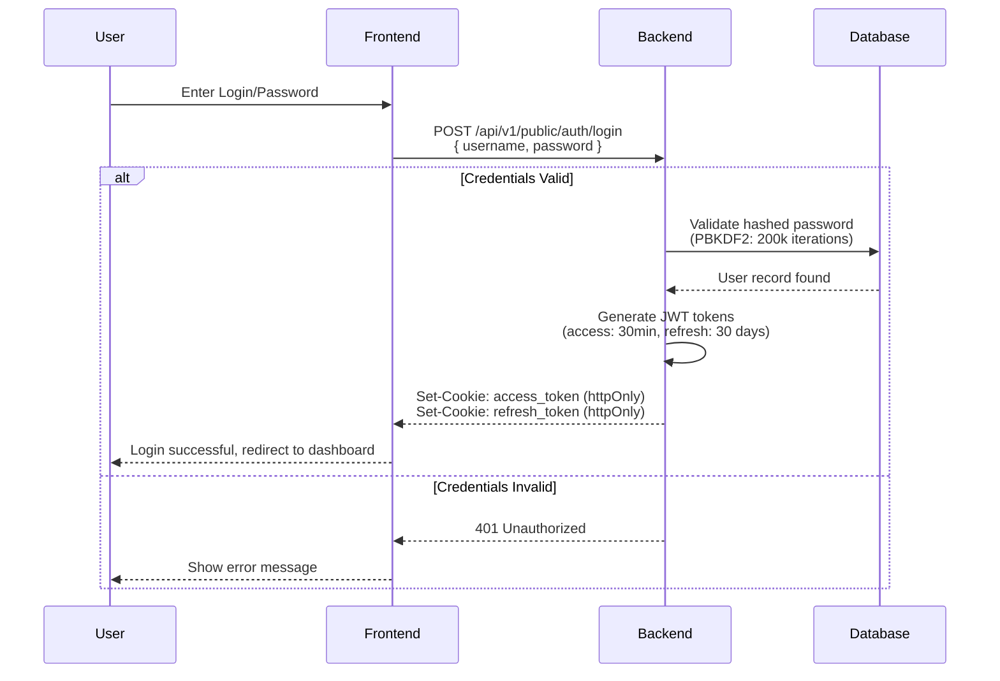
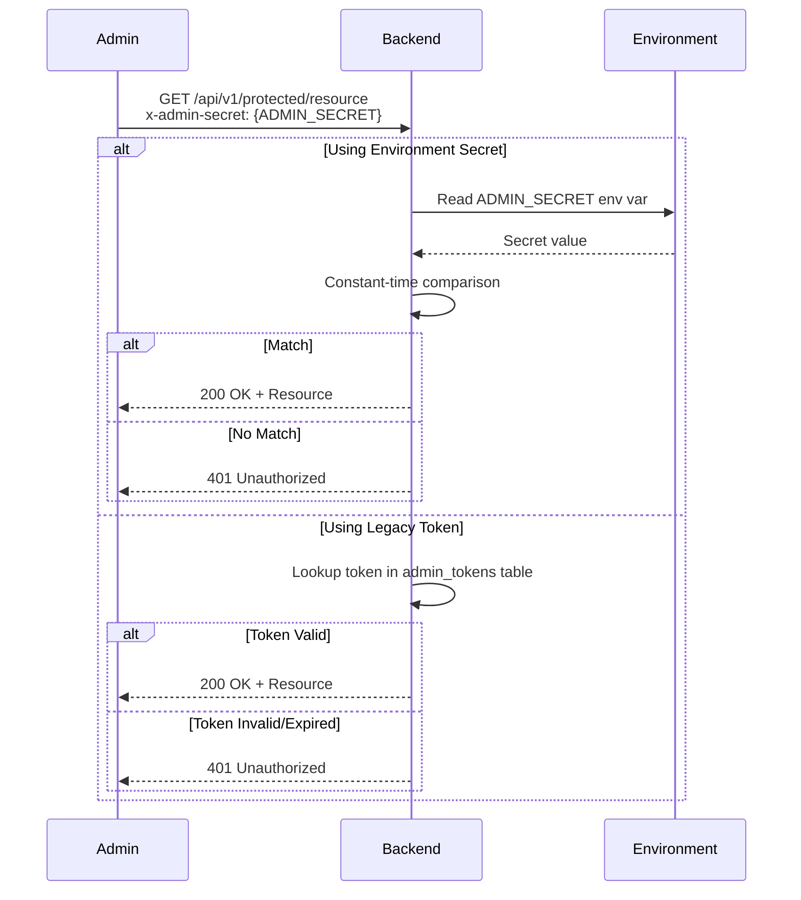
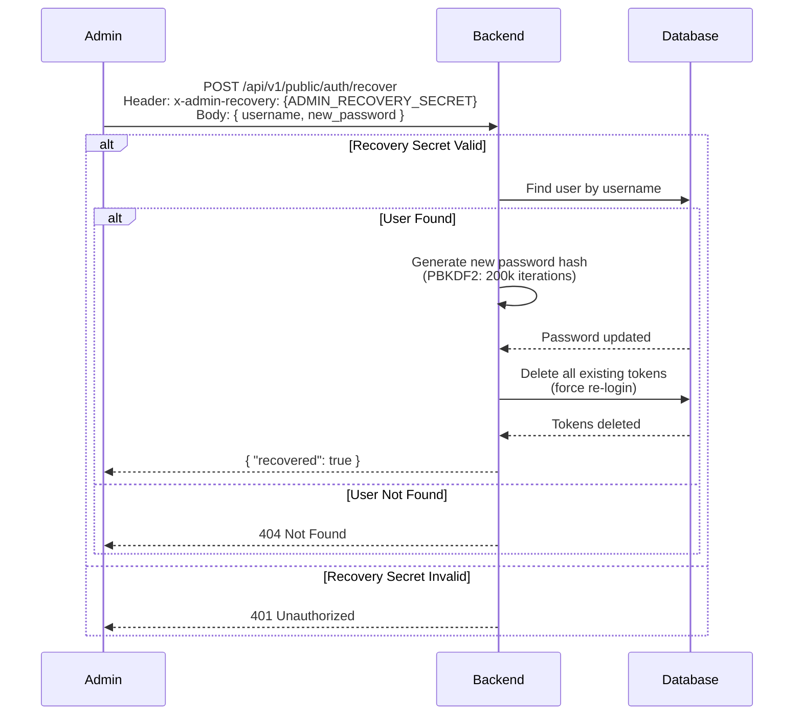
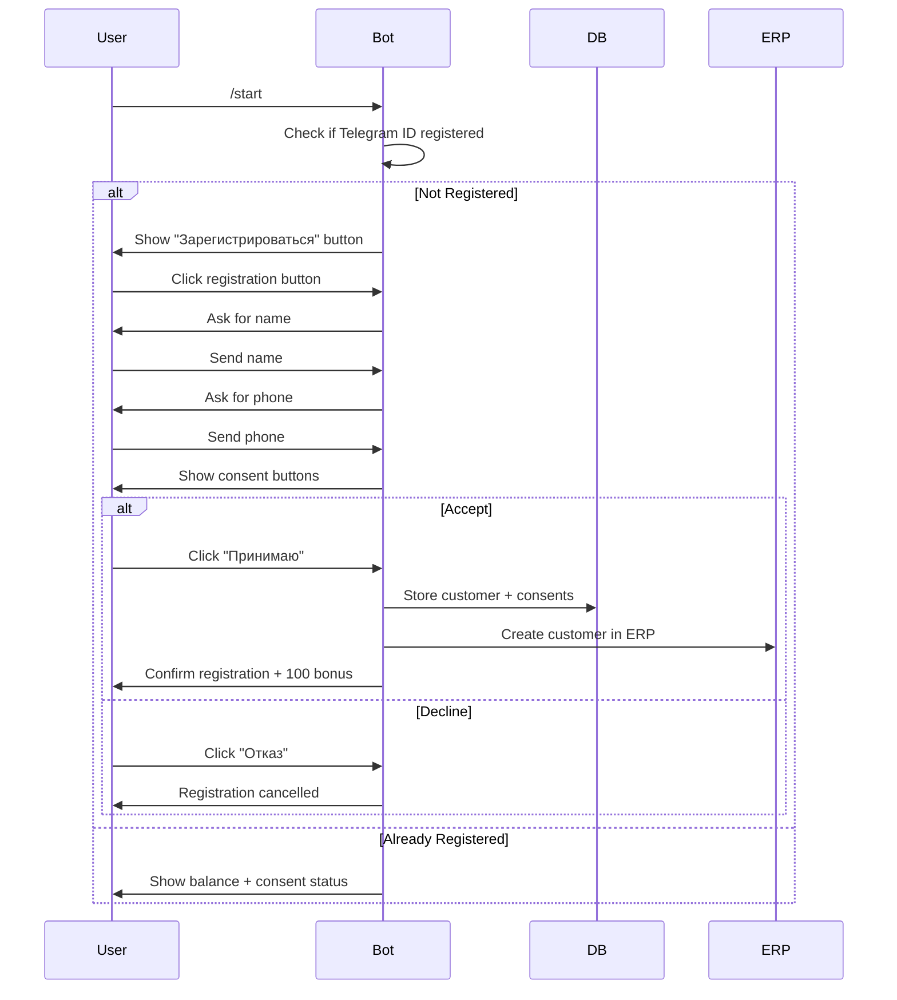
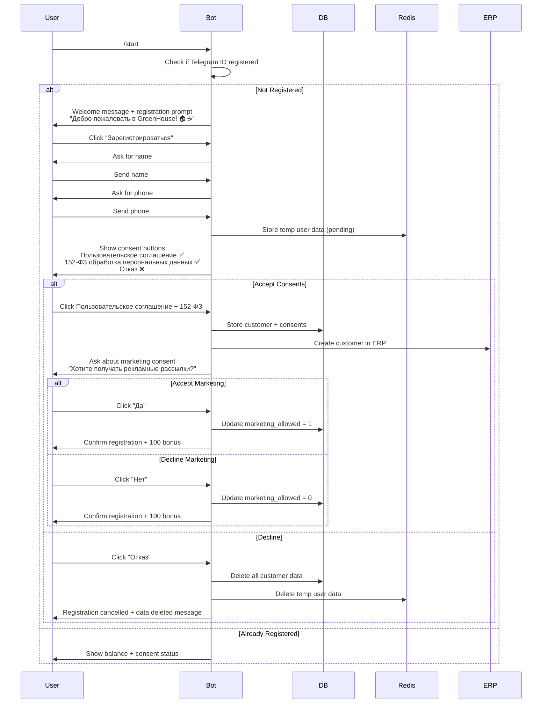
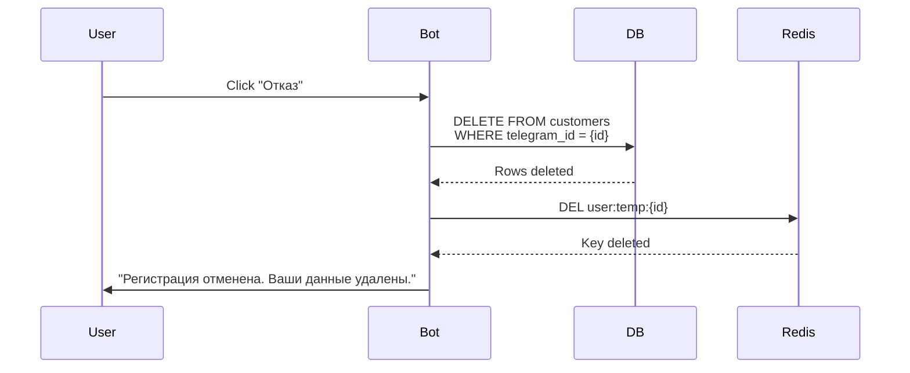

# User Journey Documentation

This document describes all authentication and authorization flows in the ERP Greenhouse system.

---

## A. Standard Entry Flow

The standard authentication flow uses JWT tokens delivered via HttpOnly cookies for maximum security.

### Flow Diagram



### Technical Details

| Aspect | Details |
|--------|---------|
| **Endpoint** | `POST /api/v1/public/auth/login` |
| **Request Body** | `{ "username": string, "password": string }` |
| **Response Headers** | `Set-Cookie` with httpOnly cookies |
| **Access Token** | 30-minute expiry (configurable via `JWT_ACCESS_TOKEN_EXPIRE_MINUTES`) |
| **Refresh Token** | 30-day expiry (configurable via `JWT_REFRESH_TOKEN_EXPIRE_DAYS`) |
| **Cookie Flags** | `httponly=true`, `samesite=lax`, `secure={ENV_BASED}` |

### Password Storage

- **Algorithm**: PBKDF2-HMAC-SHA256
- **Default Iterations**: 200,000 (configurable via `ADMIN_PBKDF2_ITER`)
- **Salt**: Random 32-byte salt per user, stored in `password_salt` column

### Code Reference

- **Login Endpoint**: [`middleware/app/admin_auth_api.py:login()`](middleware/app/admin_auth_api.py:100)
- **JWT Creation**: [`middleware/app/auth.py:create_access_token()`](middleware/app/auth.py:17)
- **Password Hashing**: [`middleware/app/security.py:hash_password()`](middleware/app/security.py)

---

## B. Admin Backdoor (CI/CD & Emergency Access)

The admin backdoor provides emergency access via a static secret header, bypassing database lookup for predefined root credentials.

### Flow Diagram



### Supported Endpoints

The backdoor works on all protected endpoints through the `require_jwt_auth` middleware:

1. **Authentication Layer**: [`middleware/app/admin_auth_api.py:require_jwt_auth()`](middleware/app/admin_auth_api.py:285)
2. **Legacy Validation**: [`middleware/app/admin_auth_api.py:require_admin_token_or_env()`](middleware/app/admin_auth_api.py:229)

### Header Specification

| Header | Value | Environment Variable |
|--------|-------|---------------------|
| `x-admin-secret` | Static secret string | `ADMIN_SECRET` |

### Security Rules

1. **Environment-Specific**:
   - **Production**: Should be DISABLED (JWT only)
   - **Development/Demo**: Allowed for testing

2. **Token Format Detection**:
   - JWT tokens (2 dots in format `xxx.yyy.zzz`) are validated as JWT
   - Non-JWT tokens are validated against `ADMIN_SECRET` or database tokens

3. **Critical Security Rule**: If a JWT is provided but fails validation, the system returns 401 immediately. It does NOT fall back to legacy authentication.

### Configuration

```bash
# Enable/disable backdoor (recommended: false in production)
ADMIN_SECRET=your-secure-secret-here

# Bootstrap default admin on startup
ADMIN_BOOTSTRAP_DEFAULT=true
ADMIN_DEFAULT_USERNAME=admin
ADMIN_DEFAULT_PASSWORD=secure-password
ADMIN_DEFAULT_ROLE=owner
```

### Code Reference

- **Token Validation**: [`middleware/app/admin_auth_api.py:require_admin_token_or_env()`](middleware/app/admin_auth_api.py:229)
- **JWT Detection**: [`middleware/app/admin_auth_api.py:_is_jwt_format()`](middleware/app/admin_auth_api.py:222)
- **Constant-time Comparison**: [`middleware/app/security.py:constant_time_equals()`](middleware/app/security.py)

---

## C. Password Recovery Flow

The password recovery flow allows administrators to reset user passwords via a secure recovery endpoint.

### Flow Diagram



### Technical Details

| Aspect | Details |
|--------|---------|
| **Endpoint** | `POST /api/v1/public/auth/recover` |
| **Required Header** | `x-admin-recovery: {ADMIN_RECOVERY_SECRET}` |
| **Request Body** | `{ "username": string, "new_password": string }` |
| **Password Requirements** | Minimum 8 characters, maximum 200 |
| **Token Invalidation** | All existing `admin_tokens` are deleted |

### Configuration

```bash
# Required for recovery to work
ADMIN_RECOVERY_SECRET=your-recovery-secret-here

# PBKDF2 iterations (optional, default: 200000)
ADMIN_PBKDF2_ITER=200000
```

### Current Implementation Status

**Location**: [`middleware/app/admin_auth_api.py:recover_password()`](middleware/app/admin_auth_api.py:636)

The implementation is functional but has the following characteristics:

1. **Single-Factor Recovery**: Only requires the recovery secret, no email verification
2. **No Audit Trail**: Does not log who performed the reset or when
3. **Immediate Effect**: All tokens are invalidated immediately
4. **No User Notification**: Does not send any notification to the user

### Security Considerations

1. **Secret Management**: The recovery secret must be:
   - Different from `ADMIN_SECRET`
   - Rotated periodically
   - Stored securely (not in version control)

2. **Access Control**: Limit access to the recovery endpoint:
   - Use network restrictions (IP allowlist)
   - Consider rate limiting
   - Log all recovery attempts

3. **Recommended Enhancements**:
   - Add email/SMS notification to user
   - Add audit log entry
   - Add rate limiting
   - Consider multi-factor recovery

### Code Reference

- **Recovery Endpoint**: [`middleware/app/admin_auth_api.py:recover_password()`](middleware/app/admin_auth_api.py:636)
- **Password Hashing**: [`middleware/app/security.py:hash_password()`](middleware/app/security.py)
- **Token Invalidation**: [`middleware/app/admin_auth_api.py:662`](middleware/app/admin_auth_api.py:662)

---

## Security Summary

| Flow | Security Level | Use Case |
|------|----------------|----------|
| Standard Login | **HIGH** | Production user authentication |
| Admin Backdoor | **MEDIUM** | CI/CD, emergency access, development |
| Password Recovery | **MEDIUM** | Admin password reset |

### Production Recommendations

1. **Disable backdoor in production**: Set `ADMIN_SECRET` to empty or remove it
2. **Use strong recovery secret**: Minimum 32 characters, randomly generated
3. **Enable secure cookies**: Set `ADMIN_COOKIE_SECURE=true`
4. **Monitor authentication logs**: Watch for brute force attempts
5. **Implement rate limiting**: Prevent login/recovery abuse

---

## D. Telegram Client Registration Flow (152-ФЗ Compliance)

This section documents the Telegram bot client registration and consent flow, ensuring compliance with Russian Federal Law 152-ФЗ (Personal Data Protection).

### Flow Diagram



### Consent Types

| Type | Description | Required |
|------|-------------|----------|
| **data_processing** | Consent to process personal data (name, phone) | Yes - for account to work |
| **marketing** | Consent to receive promotional messages | No - optional |

### Commands

| Command | Description |
|---------|-------------|
| `/start` | Start bot, show registration or balance |
| `/balance` | Check loyalty points balance |
| `/revoke_consent` | 1-click unsubscribe from marketing (152-ФЗ) |
| `/subscribe` | Re-subscribe to marketing messages |
| `/delete` | Delete profile and all data (152-ФЗ) |

### 152-ФЗ Compliance Features

1. **Explicit Consent**: Users must actively click "Принимаю" button
2. **Timestamp Logging**: All consents stored with `accepted_at` datetime
3. **Policy Version**: Consent linked to specific policy version
4. **1-Click Revocation**: `/revoke_consent` instantly disables marketing
5. **Audit Trail**: Full consent history in `consents` table

### Database Schema

**customers table** (relevant columns):
- `telegram_id` - Telegram user ID
- `phone` - Phone number (normalized)
- `full_name` - User's name
- `marketing_allowed` - 1 = can receive marketing, 0 = blocked
- `data_processing_allowed` - 1 = data processing allowed

**consents table**:
- `customer_id` - FK to customers
- `source` - "telegram" or "vk"
- `consent_version` - Policy version (e.g., "1.0.0")
- `consent_text` - Full text of what was consented to
- `consent_type` - "data_processing" or "marketing"
- `accepted_at` - Timestamp of consent

### Marketing Compliance

Marketing campaigns (via `/api/v1/marketing/campaigns/{id}/send`) only send to customers where `marketing_allowed = 1`. This ensures:
- No spam to non-consenting users
- Legal compliance with 152-ФЗ
- Audit trail of consent status

### Code Reference

- **Registration Handler**: [`middleware/app/handlers.py:cmd_start()`](middleware/app/handlers.py:216)
- **Consent Callback**: [`middleware/app/handlers.py:cb_consent()`](middleware/app/handlers.py:273)
- **Revoke Command**: [`middleware/app/handlers.py:cmd_revoke_consent()`](middleware/app/handlers.py:605)
- **Marketing API**: [`middleware/app/marketing_api.py`](middleware/app/marketing_api.py)

---

## D.2. Telegram Registration Flow v2 (Enhanced 152-ФЗ Compliance)

This section documents the enhanced Telegram bot registration flow with improved 152-ФЗ compliance, featuring separate consent buttons, explicit refusal handling with data deletion, and optional marketing consent.

### Flow Diagram



### Welcome Message

| Element | Content |
|---------|---------|
| **Message** | "Добро пожаловать в GreenHouse! 🏠☕" |
| **Purpose** | Friendly greeting to engage user |
| **Trigger** | User sends /start command |

### Consent Buttons

| Button | Type | Action |
|--------|------|--------|
| **Пользовательское соглашение** | Required | User agrees to Terms of Service |
| **152-ФЗ обработка персональных данных** | Required | User agrees to personal data processing (152-ФЗ) |
| **Отказ** | Required | User declines all consents |

### Consent Requirements

| Consent Type | Required | Description | Consequence if Declined |
|--------------|----------|-------------|------------------------|
| **Пользовательское соглашение** | Yes | Terms of Service agreement | Registration cancelled, no account created |
| **152-ФЗ обработка персональных данных** | Yes | Personal data processing consent | Registration cancelled, no account created |
| **Маркетинговые рассылки** | No | Marketing message consent | Account created without marketing access |

### Refusal Handling (Data Deletion)

When user clicks "Отказ" button:

1. **Database Deletion**: All customer records associated with the Telegram ID are permanently deleted
2. **Redis Cleanup**: Any pending registration data in Redis is removed
3. **ERP Sync**: If customer was already synced to ERP, mark as deleted
4. **User Notification**: Confirmation message sent to user



### Marketing Consent Flow

Marketing consent is asked **separately** after main consent is accepted:

1. Main consent (User Agreement + 152-ФЗ) is collected first
2. If both main consents accepted, customer is created in DB and ERP
3. Then marketing consent is asked as a separate question
4. User can accept or decline marketing independently

| Question | Options |
|----------|---------|
| "Хотите получать рекламные рассылки?" | Да (accept) / Нет (decline) |

### Database Schema Updates

**customers table** (v2 columns):
- `telegram_id` - Telegram user ID
- `phone` - Phone number (normalized)
- `full_name` - User's name
- `marketing_allowed` - 1 = can receive marketing, 0 = blocked
- `data_processing_allowed` - 1 = data processing allowed
- `tos_accepted` - 1 = Terms of Service accepted
- `registration_source` - "telegram_v2" (new for v2 flow)

**consents table** (enhanced):
- `customer_id` - FK to customers
- `source` - "telegram_v2" for new flow
- `consent_version` - Policy version (e.g., "2.0.0")
- `consent_text` - Full text of what was consented to
- `consent_type` - "data_processing", "tos", or "marketing"
- `accepted_at` - Timestamp of consent
- `declined_at` - Timestamp if consent was declined

### 152-ФЗ Compliance Features (v2)

1. **Separate Consent Buttons**: Each consent type has its own button (not combined)
2. **Explicit Refusal Handling**: Clear data deletion when user declines
3. **Timestamp Logging**: All consents and refusals stored with datetime
4. **Policy Version Tracking**: Consent linked to specific policy version
5. **Marketing Opt-In**: Marketing is opt-in only, not pre-selected
6. **Audit Trail**: Full consent/refusal history in `consents` table

### Commands (v2)

| Command | Description |
|---------|-------------|
| `/start` | Start bot, show registration or balance |
| `/balance` | Check loyalty points balance |
| `/revoke_consent` | 1-click unsubscribe from marketing (152-ФЗ) |
| `/subscribe` | Re-subscribe to marketing messages |
| `/delete` | Delete profile and all data (152-ФЗ) |

### Comparison: D vs D.2

| Feature | Section D (Original) | Section D.2 (Enhanced) |
|---------|---------------------|----------------------|
| Welcome Message | None | "Добро пожаловать в GreenHouse! 🏠☕" |
| Consent Buttons | Combined "Принимаю" | Separate buttons per consent |
| Refusal Handling | Simple cancellation | Full data deletion (DB + Redis) |
| Marketing Consent | Combined with main | Asked separately after main consent |
| Consent Types | data_processing, marketing | tos, data_processing, marketing |
| Policy Version | 1.0.0 | 2.0.0 |
| Source Identifier | telegram | telegram_v2 |

### Code Reference

- **Registration Handler v2**: [`middleware/app/handlers.py:cmd_start_v2()`](middleware/app/handlers.py)
- **Consent Callback v2**: [`middleware/app/handlers.py:cb_consent_v2()`](middleware/app/handlers.py)
- **Refusal Handler**: [`middleware/app/handlers.py:handle_refusal()`](middleware/app/handlers.py)
- **Marketing Consent**: [`middleware/app/handlers.py:cb_marketing_consent()`](middleware/app/handlers.py)
- **Data Deletion**: [`middleware/app/handlers.py:delete_user_data()`](middleware/app/handlers.py)
